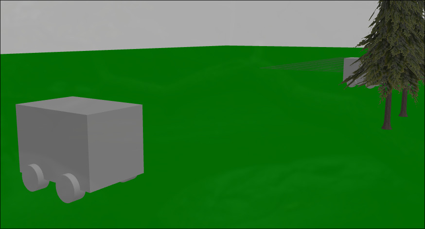
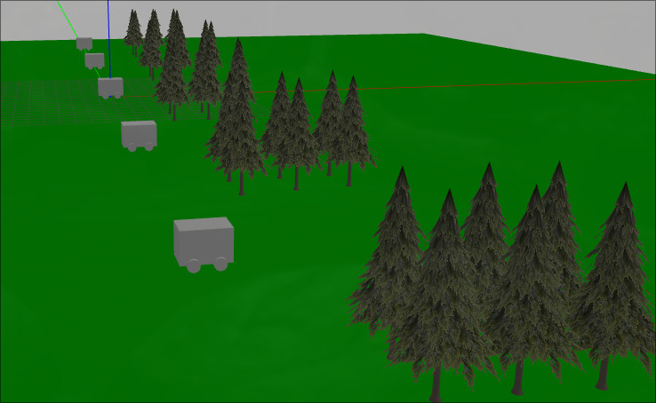

# AgriBot Swarm Simulation


A multi-robot coordination and control system built with ROS 2, designed for autonomous agricultural and monitoring operations.


## Overview

AgriBot is a robust platform for managing and controlling a fleet of autonomous rovers. It provides a comprehensive solution for coordinating multiple robots, implementing autonomous navigation patterns, and offering a web-based monitoring and control interface.

The system consists of:
- ROS 2-based backend for robot control and coordination
- Multi-robot simulation environment in Gazebo
- Web-based frontend dashboard for fleet monitoring and control
- PID-based navigation system
- State machine implementation for predefined path execution

## Environment


## Repository Structure

```
Synthetix-3.0/
├── backend/                      # ROS 2 packages and control systems
│   └── Synthetix_ws-main/
│       ├── controller/           # Main controller for multi-robot coordination
│       ├── robot_teleop_pid/     # Teleop and PID controller for manual operation
│       └── rover_desc/           # Robot model descriptions, simulation worlds
│
└── frontend/                     # Web-based monitoring interface
    └── farm-website/             # Next.js based dashboard
        ├── public/               # Static assets
        └── src/                  # Source code
            ├── app/              # Next.js app directory
            ├── components/       # React components
            ├── hooks/            # Custom React hooks
            └── lib/              # Utility functions
```


## Features

### Multi-Robot Control System
- Centralized control for up to 5 rovers simultaneously
- State machine for autonomous path execution
- PID controllers for precise movement and turn control
- ROS 2 based messaging system for robot communication

### Simulation Environment
- Detailed Gazebo simulation with multiple robot models
- Customizable world environments with various terrain features
- Realistic physics simulation with proper collision detection

### Web Dashboard
- Real-time fleet overview and individual rover status
- Battery and sensor monitoring
- VNC-based remote control interface
- Camera feed viewing capability

## Getting Started

### Prerequisites
- ROS 2 (Humble or later recommended)
- Gazebo 11+
- Node.js 16+ and npm/yarn for the frontend
- Python 3.8+

### Installation

1. **Clone the repository**
   ```bash
   git clone https://github.com/atPavithran/Synthetix-3.0.git
   cd Synthetix-3.0
   ```

2. **Set up the ROS 2 workspace**
   ```bash
   cd backend/Synthetix_ws-main
   colcon build
   source install/setup.bash
   ```

3. **Install frontend dependencies**
   ```bash
   cd ../../frontend/farm-website
   npm install
   # or
   yarn install
   ```

### Running the Simulation

1. **Launch the multi-robot simulation**
   ```bash
   ros2 launch rover_desc multirobot.launch.py
   ```

2. **Run the controller node**
   ```bash
   ros2 run controller controller
   ```

3. **Start the teleop PID controller (optional for manual control)**
   ```bash
   ros2 launch robot_teleop_pid robot_control.launch.py
   ```

### Running the Web Dashboard

```bash
cd frontend/farm-website
npm run dev
# or
yarn dev
```
Then open http://localhost:3000 in your browser.

## System Architecture

### Robot Controller
The main controller implements a finite state machine (FSM) that guides robots through a predefined path. Each robot follows a sequence of states:

1. Move forward to target X position
2. Rotate 90 degrees
3. Move forward to target Y position
4. Rotate 180 degrees
5. Move back to initial X position
6. Rotate 90 degrees
7. Return to starting Y position
8. Rotate to initial orientation

The PID controller handles smooth turns and precise movements by calculating appropriate angular velocities based on the error between current and target orientations.

### Communication System
ROS 2 topics are used for communication:
- `/robot{n}/cmd_vel` - Velocity commands for each robot
- `/robot{n}/odom` - Odometry data from each robot
- `/teleop_key/cmd_vel` - Teleop commands when in manual mode

### Web Interface
The frontend dashboard communicates with the ROS system through API endpoints, providing:
- Real-time monitoring of rover status
- Battery and sensor visualization
- Control interface for manual operation
- VNC connection for direct control

### ROS Graphs

Autonomous ROS2 Fleet Control Architecture


Hybrid Autonomous and Remote Control Architecture


## Usage Scenarios

### Autonomous Operation
1. Configure the desired path parameters in the controller.py file
2. Launch the simulation and controller
3. Monitor progress through the web dashboard

### Manual Control
1. Launch the teleop PID controller with a specified robot ID
2. Use keyboard controls or web interface to navigate
3. Switch between robots as needed

## Customization

### Adding New Robots
1. Create a new robot URDF description in the rover_desc package
2. Update the multirobot.launch.py file to include the new robot
3. Add the robot to the controller's namespace list

### Modifying Path Patterns
Edit the FSM in the controller.py file to implement different path patterns or behaviors.

## License

This project is licensed under the MIT License - see the LICENSE file for details.

## Contributors

- [Kousik S](https://github.com/kou-shik2004) - Team Lead
- [Sukesh S](https://github.com/spiceybolt) - Core Developer
- [Pavithran M](https://github.com/atPavithran) - Core Developer
- [Allen Joseph N](https://github.com/terfefed) - Core Developer

## Acknowledgments

This project builds upon several open-source technologies:
- ROS 2 (Robot Operating System)
- Gazebo Simulation
- Next.js Framework
  
